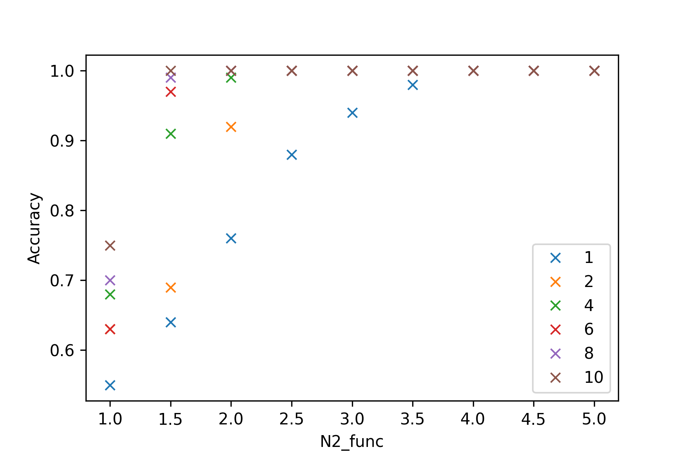
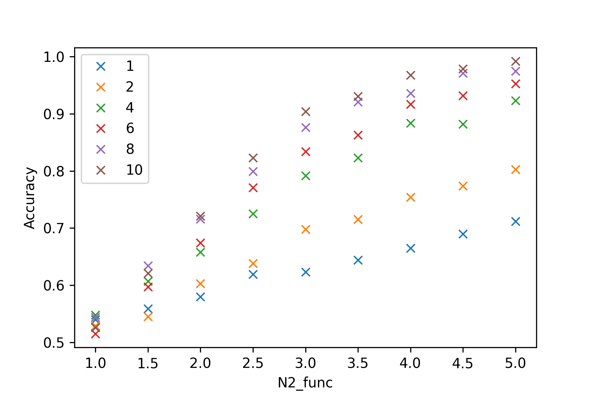
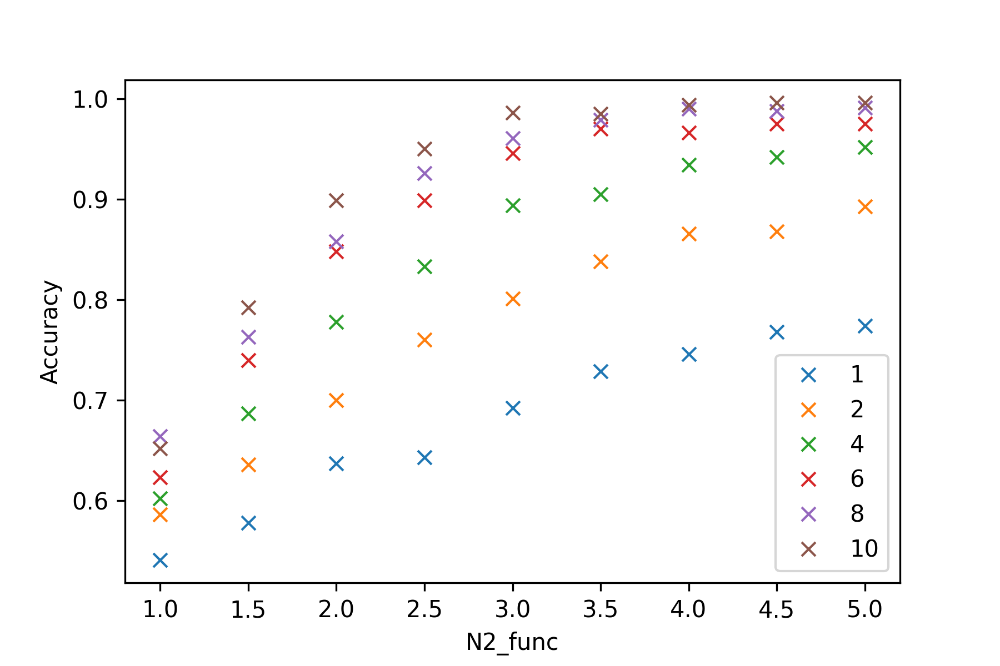

### Tutorial for baymobil: A Python package for Bayesian analysis of RNA-Seq data for detecting mobile mRNA in grafting experiments


#### Installation
The source code is available from: https://github.com/mtomtom/baymobil.

The package can be installed from testpypi by running:
`pip install -i https://test.pypi.org/simple/ baymobil`

The package requires numpy, pandas and scipy. 

To access the function in baymobil, import as package e.g.:
`import baymobil as baymob`

#### Basic functions
baymobil has two basic functions:
1. Create and analyse simulated datasets, comparing performance across different approaches
2. Analyse existing RNA-Seq datasets.

Here, we will examine these two cases separately, describing all of the relevant functions and how they are called within the package. Both cases involve the calculation of Bayes factors, which describe the evidence that some or all reads associated with SNPs from type 2 (non-local - potentially indicative of transported transcripts) actually come from type 2, compared with the evidence that all such reads can be explained sequencing errors. SNP-specific error rates can be inferred from homograft data (e.g. type1:type1), as described in (ref our paper).

##### Creating simulated datasets
Simulated datasets can be used to test the performance of different mobile transcript identification approaches. They provide correctly labelled data, along with the ability to alter the rate at which we see sequencing errors, and also the sequencing depths. Our simulated datasets create files designed to represent processed RNA-Seq data. Each entry represents a single SNP, and has values for the reads that correspond to the local type N (ecotype, species or cultivar), and the distal type, n. Sequencing errors can be the same for all SNPs, or vary between them. We can also specify how many SNPs each transcript has, and how many replicates to simulate.

All of these parameters are contained in the file "parameters.cfg", which needs to be located in the folder from which the function is being called. The parameters found in this file are shown in Table 1. Each simulation is designed to investigate the accuracy of the Bayesian approach, plus comparison with two other approaches (Method A inspired by \cite{Thieme:2015tx}, Method B inspired by \cite{wang_universal_2020}). 

| Parameter           | Data type | Description                               |
|---------------------|-----------|-------------------------------------------|
| N_values            | list      | Heterograft read depth                    |
| q_values            | list      | Error rate                                |
| N2_values           | int       | N2_func rate                              |
| constant_Nhom       | boolean   | Whether to use a different value for Nhom |
| constant_Nhom_value | int       | Define the value of constant_Nhom         |
| random_N            | boolean   | Whether to use random values for N        |
| random_Nhom         | boolean   | Whether to use random values for Nhom     |
| random_q            | boolean   | Whether to use random values for q        |
| no_transcripts      | int       | Number of transcripts                     |
| no_SNPs             | int       | Number of SNPs                            |
| no_reps             | int       | Number of replicates                      |
| min_read_thresh     | int       | SNP threshold for Method A                |


###### Case 1: Accuracy as a function of the number of added reads
In this example, we are going to investigate the effect of changing the number of reads added to SNPs designated as being from the second plant type ($n$) on the accuracy of the Bayesian analysis. We repeat the simulations across a range of SNPs per transcript, ranging from 1 to 10.

| Parameter      | Values                              |
| -------------  | ----------------------------------- |
| N_values       | [1000]                              |
| q_values       | [0.01]                              |
| N2_values      | [1, 1.5, 2, 2.5, 3, 3.5, 4, 4.5, 5] | 
| constan_Nhom   | False                               |
| random_N       | False                               |
| random_Nhom    | False                               |
| random_q       | False                               |
| no_transcripts | [1000]                              |
| np_reps        | [1]                                 |


For the values that are lists (N_values, q_values, N2_values), more than one parameter can be assigned, although if only one parameter is given, it should still be in list format i.e. in square brackets. 

Once the parameters.cfg file has been updated, the simulations can be run with:

```
import baymobil as baymob
# Define the parameter that we are varying
func_parameter = 'N2_values'
baymob.simulations.create_simulated_data(func_parameter)
```

This function should be called from the same folder as the "parameter.cfg" file. It will create a folder called "output", deleting any previous "output" folders first, and all results will go into this folder. Each replicate will have its own output<$R$>.csv file, with $R$ being the replicate ID.

Collating and plotting the data is then performed using the functions:

```
## This function imports and combines all replicates. It looks for all of the files in the 'output' folder that contain the word 'output'
df = baymob.load_data()
baymob.plot_data_bf(df, func_parameter)
```

The number of reads added to the mobile SNPs affects the performance of the Bayesian method

###### Case 2: Accuracy as a function of the number of added reads for "noisy" datasets

Real biological data are noisy and RNA-Seq read numbers spread by nature across a certain range, we can account for this in our simulations through the use of random values for $N$ and $q$. When the random_N or random_Nhom flags are set to "True", then the respective $N$ or $Nhom$ for each SNP is initialised using a random uniform number between 10 and N_values. In the same way, if random_q is set to "True", then $q$ is initialised using a random number drawn from a uniform distribution between 0 and q_values. 


| Parameter      | Values                              |
| -------------  | ----------------------------------- |
| N_values       | [1000]                              |
| q_values       | [0.01]                              |
| N2_values      | [1, 1.5, 2, 2.5, 3, 3.5, 4, 4.5, 5] | 
| constan_Nhom   | False                               |
| random_N       | True                                |
| random_Nhom    | True                                |
| random_q       | True                                |
| no_transcripts | [1000]                              |
| np_reps        | [1]                                 |



As the accuracy of the method depends upon how well the error rates are defined in the homograft data, we can also show that if this is set to a constant value able to capture the error rate, then the accuracy of the method is improved.



| Parameter           | Values                              |
| -------------       | ----------------------------------- |
| N_values            | [1000]                              |
| q_values            | [0.01]                              |
| N2_values           | [1, 1.5, 2, 2.5, 3, 3.5, 4, 4.5, 5] | 
| constan_Nhom        | True                                |
| constant_Nhom_value | 1000                                |
| random_N            | True                                |
| random_Nhom         | True                                |
| random_q            | True                                |
| no_transcripts      | [1000]                              |
| np_reps             | [1]                                 |

###### Key functions for running and plotting the simulations


| Function | Calling function | Description |
| ----------- | -------------------- | ---------------| 
| baymob.simulations.load_parameters() | create_simulated_data() | Reads the parameters.cfg file |
| baymob.simulations.create_homograft_data() | create_simulated_data() | Creates the homograft dataframe |
| baymob.simulations.create_heterograft_data() | create\_simulated\_data() | Creates the heterograft dataframes |
| baymob.simulations.run_analysis() |  |  |
| baymob.plot_data.load_data() | User | |
| baymob.plot_data.plot_data_all() | User | Plots the accuracy for all three methods |
| baymob.plot_data.plot_data_bf() | User | Plots accuracy for bayes factors only |


##### RNA-Seq data analysis

This next section will look at running the Bayesian analysis for standalone datasets, taken from RNA-Seq data. Here, the main function is passed a list that either contains integers (single datapoint), dataframes, or filenames.


###### Key functions for running and plotting the simulations

| Function | Calling function | Description |
| ---------- | ---------------------- | ------------------- |
| baymob.safebeta() | baymob.run\_bayes\_analysis() | Function to calculate and return the values for the beta function |
| baymob.fasterpostN2() | baymob.calculate\_evidence() | Contains all of the Bayesian analysis |
| baymob.check\_data() | baymob.run\_bayes\_analysis() |  Checks the validity of the data |
| baymob.check\_data\_df() | baymob.run\_bayes\_analysis() | Checks the validity of the dataframes |
| baymob.calculate\_evidence() | baymob.run\_bayes\_analysis() |Passes the given data to the fasterpostN2 function |
| baymob.run\_bayes\_analysis\_files() | baymob.run\_bayes\_analysis() | Runs the Bayesian analysis on files  |
| baymob.run\_bayes\_analysis\_df() | baymob.run\_bayes\_analysis() | Runs the Bayesian analysis on dataframes |
| baymob.run\_bayes\_analysis() | User | Main function for the anaylsis |


###### Input data table {#inputdatatable}
| Reads from t1/t1 homograft | Reads from t1/t1 homograft | Reads from t2/t2 homograft | Reads from t2/t2 homograft | heterograft reads | heterograft reads |
|----------------------------|----------------------------|----------------------------|----------------------------|-------------------|-------------------|
|                            |                            |                            |                            |                   |                   |
| Type 1 SNP                 | Type 2 SNP                 | Type 2 SNP                 | Type 1 SNP                 | Local type SNP    | Distal type SNP   |
|                            |                            |                            |                            |                   |                   |
| Nhom1                      | nhom1                      | Nhom2                      | nhom2                      | N                 | n                 |
| 1000                       | 10                         | 1000                       | 10                         | 1000              | 30                |

